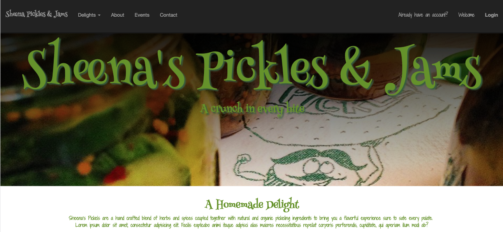

#Ecommerce site in node.js, express, mongodb and angular. Full stack MEAN

##front-end is entirely angular.js, HTML, and CSS

##back-end is an api driven by Express.js and mongodb in node.js





###This is an application created for the marketing and sale of products produced by Sheena Moore. 

Visit here: [Sheena's Pickles](http://shirletterly.com/sheenas-pickles/#/)

##Built with:
	- Html
	- CSS
	- Bootstrap
	- SASS
	- AngularJS
	- Express 
	- NodeJS
	- MongoDB

##Sample Code
###The following code was created inside the mainController to take the users selected items and store the in the cookies as a cart that can then be accessed for amount and price calculation for checkout.

```javascript
$scope.addToCart = function(idOfitem, quantity, amount){
	var oldCart = $cookies.get('cartItems');
	if (oldCart === undefined){
		var newCart = idOfitem
	}
	else {
		newCart = oldCart + "," + idOfitem;
	}
	console.log(oldCart);
	console.log(newCart);
	
	var oldQuantity = $cookies.get('cartQuantity');
	if (oldQuantity === undefined){
		var newQuantity = quantity;
	}
	else {
		newQuantity = oldQuantity + "," + quantity;
	}
	
	var oldAmount = $cookies.get('cartAmount');
	if (oldAmount === undefined){
		var newAmount = amount;
	}
	else {
		newAmount = oldAmount + "," + amount
	}

	$cookies.put('cartItems', newCart);
	$cookies.put('cartQuantity', newQuantity);
	$cookies.put('cartAmount', newAmount);
	
	newQuantity = newQuantity.split(",");
	console.log(quantity);
	console.log(newQuantity);
	var cartItems = newCart.split(",");
		$scope.item = $cookies.get('cartItems').split(',');
		$scope.quantity = $cookies.get('cartQuantity').split(',');
		$scope.amount = $cookies.get('cartAmount').split(',');
		var carts = [];
		for(var i = 0; i < cartItems.length; i++){
			carts.push({
					item: cartItems[i],
					quantity: newQuantity[i],
					amount: newAmount[i]
			})
			console.log(carts);	
		}
		$scope.carts = carts;
}
```


#### Site Features


<!-- add a video of interaction with the site -->

##Future Add-ons
- Admin portal for access to customer purchases.
- Ability for visitors to send messages directly from the site to owner.
- An enhanced UX/UI design that encourages more visitors.


###Please visit my personal profile to see more current projects.
- [Shirlette Chambers](https://github.com/Shirlazybrat)